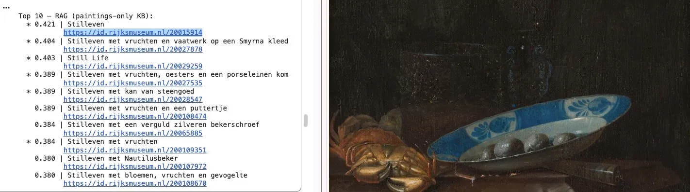

# Blue-n-White
### Beyond Keywords: Retrieving Blue-and-White Ceramics in Dutch Paintings with Knowledge-Augmented CLIP
> **Work in progress** 

---

## Overview

This project uses [CLIP](https://github.com/openai/CLIP) (Contrastive Language-Image Pretraining) to systematically retrieve and analyse depictions of blue-and-white ceramic objects in Dutch Golden Age paintings from the [Rijksmuseum](https://data.rijksmuseum.nl) open-access collection.

In the 17th century, the Dutch East India Company (VOC) imported large quantities
of Chinese export porcelain. Japanese and Dutch potters soon produced visually
near-identical imitations. All three types appear in Golden Age paintings, and even
specialists struggle to distinguish them in painted form. Museum metadata often
under-describes or misidentifies these objects, making keyword search unreliable.

We compare three retrieval approaches on a dataset of 150 Rijksmuseum paintings
with 28 manually annotated ground-truth positives:

- **Metadata keyword search** at three expertise levels (general, basic, expert)
- **CLIP zero-shot retrieval** using averaged text prompt embeddings
- **Knowledge-augmented CLIP** augmenting the query with annotations from a 30-image knowledge base of reference paintings and ceramic photographs

---

## Key finding

Knowledge-augmented CLIP with a painting-only knowledge base substantially outperforms both metadata search and zero-shot CLIP, without requiring specialist terminology from the user.

*Top-ranked paintings retrieved by Knowledge-augmented CLIP query across 150 Rijksmuseum Dutch Golden Age paintings. A Still Life from Pieter Gallis with a Chinese plate scores highest.*

---

## Demo
An interactive demo is available on Hugging Face Spaces:
👉 [https://huggingface.co/spaces/yzhao-is/Blue-n-White](https://huggingface.co/spaces/YangZhao2026/blue-n-white)
---

## Requirements

All code runs in Google Colab (free tier). No local setup needed.

Dependencies installed automatically in the notebook:
- `clip` (OpenAI)
- `torch`
- `Pillow`
- `requests`
- `matplotlib`

---

## Data

Paintings are retrieved via the [Rijksmuseum Linked Art Search API](https://data.rijksmuseum.nl/docs/search) — no API key required. All images are open access under CC0 / Public Domain.

---

## Usage

1. Open `blue_n_white.ipynb` in Google Colab
2. Run cells sequentially
3. Adjust `max_items` and CLIP prompts as needed

---

## Author

Yang Zhao — PhD student in Information Science, Syracuse University  
Research interests: digital humanities, information accessibility, visual cultural materials  
GitHub: [yzhao-is](https://github.com/yzhao-is)

---

## License

Data: Rijksmuseum collection images are CC0. Please refer to the [Rijksmuseum data policy](https://data.rijksmuseum.nl/policy/) for full terms.
