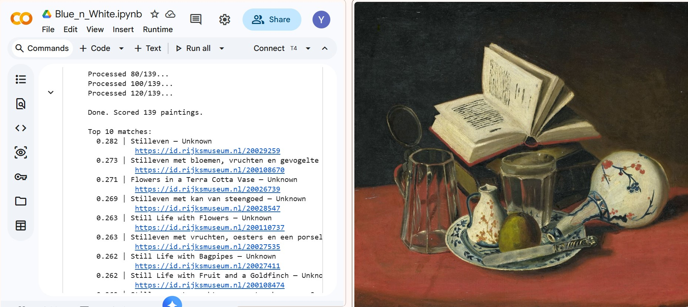

# Blue-n-White
### Computer Vision, Visual Ambiguity, and Ceramic Materiality in Dutch Golden Age Painting

> **Work in progress** — code and data accompanying a paper submitted to *magazén: International Journal for Digital and Public Humanities* (2026).

---

## Overview

This project uses [CLIP](https://github.com/openai/CLIP) (Contrastive Language-Image Pretraining) to systematically retrieve and analyse depictions of blue-and-white ceramic objects in Dutch Golden Age paintings from the [Rijksmuseum](https://data.rijksmuseum.nl) open-access collection.

The research argues that CLIP's inability to reliably distinguish Chinese export porcelain from Delft imitations is not merely a technical limitation — it reflects a genuine epistemological condition: the painter's act of representation already translates the material differences between glazed earthenware and porcelain into pure visual sign, and digital image capture performs a further mediation. The model's failure at classification thus mirrors a historiographic problem inherent to the painted record itself.

---

## Prototype Result

*Top-ranked paintings retrieved by CLIP zero-shot query across 150 Rijksmuseum Dutch Golden Age paintings. A Still Life from an unknown artist with a Chinese vase scores highest in blind retrieval without metadata input.*

---

## Requirements

All code runs in Google Colab (free tier). No local setup needed.

Dependencies installed automatically in the notebook:
- `clip` (OpenAI)
- `torch`
- `Pillow`
- `requests`
- `matplotlib`

---

## Data

Paintings are retrieved via the [Rijksmuseum Linked Art Search API](https://data.rijksmuseum.nl/docs/search) — no API key required. All images are open access under CC0 / Public Domain.

---

## Usage

1. Open `blue_n_white.ipynb` in Google Colab
2. Run cells sequentially
3. Adjust `max_items` and CLIP prompts as needed

---

## Author

Yang Zhao — PhD student in Information Science, Syracuse University  
Research interests: digital humanities, information accessibility, visual cultural materials  
GitHub: [yzhao-is](https://github.com/yzhao-is)

---

## License

Code: [MIT License](LICENSE)  
Data: Rijksmuseum collection images are CC0. Please refer to the [Rijksmuseum data policy](https://data.rijksmuseum.nl/policy/) for full terms.
